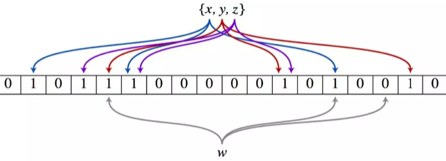

# 学习笔记

## 位运算

###  为什么需要位运算

* 机器里的数字表示方式和存储格式就是 二进制
*  十进制 <—> 二进制 : 如何转换?

#### 参考链接

- [如何从十进制转换为二进制](https://zh.wikihow.com/从十进制转换为二进制)

### 位运算符

|   含义   | 运算符 |         示例         |
| :------: | :----: | :------------------: |
|   左移   |   <<   |  0011 << 1 => 0110   |
|   右移   |   >>   |  0110 >> 1 => 0011   |
|  按位或  |   \|   | 0011 \| 1011 => 1011 |
|  按位与  |   &    | 0011 & 1011 => 0011  |
| 按位取反 |   ~    |    ~0011 => 1100     |
| 按位异或 |   ^    | 0011 ^ 1011 => 1000  |
|          |        |                      |

###  XOR-异或

* 异或:相同为 0，不同为 1。也可用“不进位加法”来理解。 

* 异或操作的一些特点:
  - x^0=x
  - x^1s=~x //注意 1s = ~0
  - x^(~x)=1s
  - x^x=0
  - c=a^b => a^c=b,b^c=a //交换两个数 
  - a^b^c=a^(b^c)=(a^b)^c //associative

####  指定位置的位运算

1. 将x最右边的n位清零:x&(~0<<n)

2. 获取x的第n位值(0或者1):(x>>n)&1

3. 获取x的第n位的幂值:x&(1<<n)

4. 仅将第n位置为1:x|(1<<n)

5. 仅将第n位置为0:x&(~(1<<n))

6. 将x最高位至第n位(含)清零:x&((1<<n)-1)

####  实战位运算要点

* 判断奇偶:
  x%2==1 —>(x&1)==1
  x%2==0 —>(x&1)==0
* x>>1—>x/2.
  即: x=x/2; —> x=x>>1;
  mid=(left+right)/2; —> mid=(left+right)>>1;

* X=X&(X-1)清零最低位的1

*  X&-X=>得到最低位的1

* X&~X=>0

#### 参考链接

- [N 皇后位运算代码示例](https://shimo.im/docs/YzWa5ZZrZPYWahK2)

#### 实战题目 / 课后作业

- [位 1 的个数](https://leetcode-cn.com/problems/number-of-1-bits/)（Facebook、苹果在半年内面试中考过）
- [2 的幂](https://leetcode-cn.com/problems/power-of-two/)（谷歌、亚马逊、苹果在半年内面试中考过）
- [颠倒二进制位](https://leetcode-cn.com/problems/reverse-bits/)（苹果在半年内面试中考过）
- [N 皇后](https://leetcode-cn.com/problems/n-queens/description/)（字节跳动、亚马逊、百度在半年内面试中考过）
- [N 皇后 II ](https://leetcode-cn.com/problems/n-queens-ii/description/)（亚马逊在半年内面试中考过）
- [比特位计数](https://leetcode-cn.com/problems/counting-bits/description/)（字节跳动、Facebook、MathWorks 在半年内面试中考过）

## 布隆过滤器 Bloom Filter

###  Bloom Filter vs Hash Table

* 一个很长的二进制向量和一系列随机映射函数。布隆过滤器可以用于检索

* 一个元素是否在一个集合中。

* 优点是空间效率和查询时间都远远超过一般的算法，

* 缺点是有一定的误识别率和删除困难。

####  案例

1. 比特币网络

2. 分布式系统(Map-Reduce) — Hadoop、search engine

3. Redis 缓存

4. 垃圾邮件、评论等的过滤

   [科普](https://www.cnblogs.com/cpselvis/p/6265825.html https://blog.csdn.net/tianyaleixiaowu/article/details/74721877)

####  布隆过滤器示意图

#### 参考链接

- [布隆过滤器的原理和实现](https://www.cnblogs.com/cpselvis/p/6265825.html)
- [使用布隆过滤器解决缓存击穿、垃圾邮件识别、集合判重](https://blog.csdn.net/tianyaleixiaowu/article/details/74721877)
- [布隆过滤器 Python 代码示例](https://shimo.im/docs/UITYMj1eK88JCJTH)
- [布隆过滤器 Python 实现示例](https://www.geeksforgeeks.org/bloom-filters-introduction-and-python-implementation/)
- [高性能布隆过滤器 Python 实现示例](https://github.com/jhgg/pybloof)
- [布隆过滤器 Java 实现示例 1](https://github.com/lovasoa/bloomfilter/blob/master/src/main/java/BloomFilter.java)
- [布隆过滤器 Java 实现示例 2](https://github.com/Baqend/Orestes-Bloomfilter)

## LRU Cache

####  LRU Cache

* 两个要素: 大小 、替换策略

*  Hash Table + Double LinkedList

* O(1) 查询   

  O(1) 修改、更新

####  LRU cache 工作示例

​	

###  替换策略

* LFU - least frequently used 

* LRU - least recently used

#### 参考链接

- [Understanding the Meltdown exploit](https://www.sqlpassion.at/archive/2018/01/06/understanding-the-meltdown-exploit-in-my-own-simple-words/)
- [替换算法总揽](https://en.wikipedia.org/wiki/Cache_replacement_policies)
- [LRU Cache Python 代码示例](https://shimo.im/docs/CoyPAyXooGcDuLQo)

#### 实战题目 / 课后作业

- [LRU 缓存机制](https://leetcode-cn.com/problems/lru-cache/#/)（亚马逊、字节跳动、Facebook、微软在半年内面试中常考）

## 排序

###  排序算法

1. 比较类排序: 通过比较来决定元素间的相对次序，由于其时间复杂度不能突破
   O(nlogn)，因此也称为非线性时间比较类排序。

2. 非比较类排序:
    不通过比较来决定元素间的相对次序，它可以突破基于比较排序的时间下界，以线性时间运行，因此也称为线性时间非比较类排序

           | O(n ^ 2)           | O(n)               | O(1)       | 稳定   |
| 希尔排序 | O(n ^ 1.3)         | O(n ^ 2)           | O(n)               | O(1)       | 不稳定 |
| 选择排序 | O(n ^ 2)           | O(n ^ 2)           | O(n ^ 2)           | O(1)       | 不稳定 |
| 堆排序   | O(nlogn)           | O(nlogn)           | O(nlogn)           | O(1)       | 不稳定 |
| 冒泡排序 | O(n ^ 2)           | O(n ^ 2)           | O(n)               | O(1)       | 稳定   |
| 快速排序 | O(nlogn)           | O(n ^ 2)           | O(nlogn)           | O(nlogn)   | 不稳定 |
| 归并排序 | O(nlogn)           | O(nlogn)           | O(nlogn)           | O(n)       | 稳定   |
|          |                    |                    |                    |            |        |
| 计数排序 | O(n+k)             | O(n+k)             | O(n+k)             | O(n+k)     | 稳定   |
| 桶排序   | O(n+k)             | O(n ^ 2)           | O(n)               | O(n+k)     | 稳定   |
| 基数排序 | O(n*k)             | O(n*k)             | O(n*k)             | O(n+k)     | 稳定   |

###  初级排序 - O(n^2)

1. 选择排序(Selection Sort) 每次找最小值，然后放到待排序数组的起始位置。

2. 插入排序(Insertion Sort) 从前到后逐步构建有序序列;对于未排序数据，在已排序序列中从后 向前扫描，找到相应位置并插入。

3. 冒泡排序(Bubble Sort) 嵌套循环，每次查看相邻的元素如果逆序，则交换。

###  高级排序 - O(N*LogN)

* 快速排序(Quick Sort)
  数组取标杆 pivot，将小元素放 pivot左边，大元素放右侧，然后依 次对右边和右边的子数组继续快排;以达到整个序列有序。

* 归并排序(Merge Sort)— 分治

  1. 把长度为n的输入序列分成两个长度为n/2的子序列; 
  2. 对这两个子序列分别采用归并排序;

  3. 将两个排序好的子序列合并成一个最终的排序序列。

  4. 归并和快排

     * 归并 和 快排 具有相似性，但步骤顺序相反

     * 归并:先排序左右子数组，然后合并两个有序子数组

     * 快排:先调配出左右子数组，然后对于左右子数组进行排序

* 堆排序(Heap Sort) — 堆插入 O(logN)，取最大/小值 O(1)

1. 数组元素依次建立小顶堆
2. 依次取堆顶元素，并删除

###  特殊排序 - O(n)

* 计数排序(Counting Sort) 计数排序要求输入的数据必须是有确定范围的整数。将输入的数据值转化为键存 储在额外开辟的数组空间中;然后依次把计数大于 1 的填充回原数组

* 桶排序(Bucket Sort)
  桶排序 (Bucket sort)的工作的原理:假设输入数据服从均匀分布，将数据分到 有限数量的桶里，每个桶再分别排序(有可能再使用别的排序算法或是以递归方 式继续使用桶排序进行排)。

* 基数排序(Radix Sort) 基数排序是按照低位先排序，然后收集;再按照高位排序，然后再收集;依次类 推，直到最高位。有时候有些属性是有优先级顺序的，先按低优先级排序，再按 高优先级排序

###  排序动画

* https://www.cnblogs.com/onepixel/p/7674659.html 

* https://www.bilibili.com/video/av25136272

* https://www.bilibili.com/video/av63851336

###  实战题目

* https://leetcode-cn.com/problems/relative-sort-array/

* https://leetcode-cn.com/problems/valid-anagram/

* https://leetcode-cn.com/problems/design-a-leaderboard/ • https://leetcode-cn.com/problems/merge-intervals/

* https://leetcode-cn.com/problems/reverse-pairs/

### 参考链接

- [十大经典排序算法](https://www.cnblogs.com/onepixel/p/7674659.html)
- [快速排序代码示例](https://shimo.im/docs/TX9bDbSC7C0CR5XO)
- [归并排序代码示例](https://shimo.im/docs/sDXxjjiKf3gLVVAU)
- [堆排序代码示例](https://shimo.im/docs/M2xfacKvwzAykhz6)